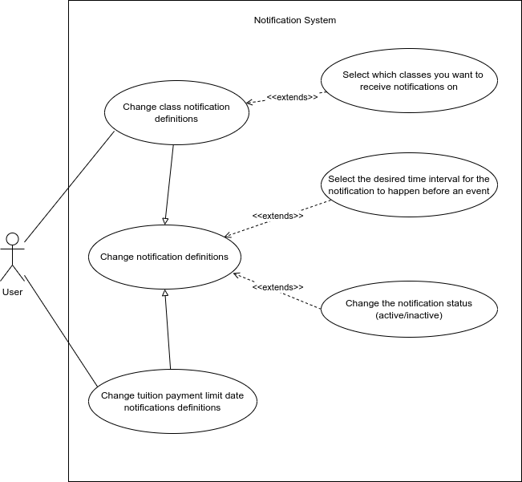

# 3LEIC09T1

## Team UniNotif

### Members

- Afonso Monteiro (201907284)
- Marcelo Couto (201906086)
- Francisco Oliveira (201907361)
- Rui Moreira (201906355)
- José Costa (202004823)

## Product Vision

Our project aims to provide members of *Faculdade de Engenharia Universidade do Porto* with a variety of notifications regarding specific events related to their degree, such as classes or tuition payment limits.

As sigarra has no notification system in place, our product aims to differentiate UNI by adding one. We believe this feature will aid the user not to forget events within its interest, as well as improve the app's usability and overall user experience.

### Main Features

- Notifications on the user's schedule;
- Notifications on the payment of tuition fees.

### API's to use

- Student's timetable from sigarra;
- Student's billing information from sigarra.

## Requirements

#### Nonfunctional

- The system should be developped using Flutter version 2.0.*
- The system should be available and fully functional for both IOS and Android devices  

### Use Cases

#### Deactivate tuition fee payment limit notification

| *Name* | Deactivate tuition fee payment limit notification |
|---|---|
| *Actor* | User |
| *Description* | The user deactivates notifications that are triggered when the payment limit for tuition fees is near |
| *Preconditions* | The user is logged in and has tuition fee notifications activated |
| *Postconditions* | The referred notification type is deactivated  |
| *Normal flow* |  1. The user accesses his notification's settings.   2. The system displays a list of notification types  3. The user selects "Tuition Fee Payment Limit"  4. The user slides a slider that deactivates that type of notification |
| *Alternative flows and exceptions* |  2. [Change failure] If, in step 2 of the normal flow, the information is unobtainable, the system doesn't display the notification |

#### Change class notification parameters

|||
| --- | --- |
| *Name* | Change class notification parameters |
| *Actor* |  User |
| *Description* | The user costumizes a variety of parameters for his class's notifications. |
| *Preconditions* | - The user has his notifications active.   - The user must be enrolled in the particular course. |
| *Postconditions* | A new set of notification parameters replaces the previously established one.|
| *Normal flow* | 1. The user accesses his notification's settings.   2. The system displays all possible courses.   3. The user selects which course to proceed.   4. The user selects which parameters to alter.   5. The system alters the class's notifications settings.   6. The system redirects the user to the notification's settings.|
| *Alternative flows and exceptions* | 1. [Change failure] If, in step 3 of the normal flow the user is not enrolled in the course selected, the system displays a message stating that same situation. It then gives the user the possibility to reselect the course. |
