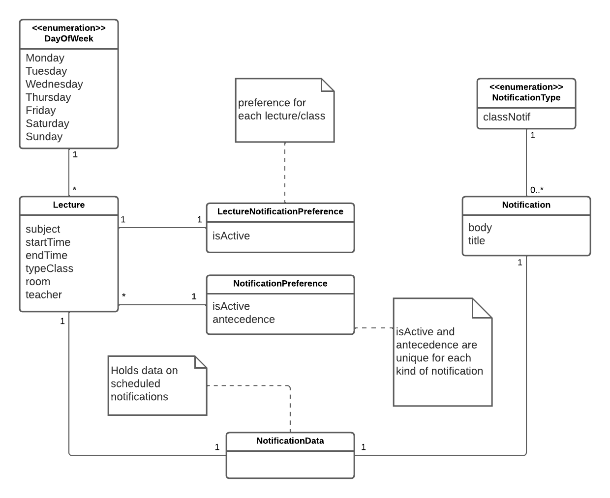

# 3LEIC09T - Team UniNotif Development Report

Welcome to the documentation pages of the UniNotif!

You can find here detailed about the product, from a high-level vision to low-level implementation decisions, a kind of Software Development Report, organized by discipline (as of RUP): 

<!-- * Business modeling  -->
* [Product Vision](#product-vision)
  <!-- * [Elevator Pitch](#Elevator-Pitch) -->
- [3LEIC09T - Team UniNotif Development Report](#3leic09t---team-uninotif-development-report)
    - [Members](#members)
  - [Product Vision](#product-vision)
    - [Main Features](#main-features)
    - [API's to use](#apis-to-use)
  - [Requirements](#requirements)
    - [Use Case Model](#use-case-model)
    - [Domain Model](#domain-model)
  - [Architecture and Design](#architecture-and-design)
    - [Logical Architecture](#logical-architecture)
    - [Physical Architecture](#physical-architecture)
    - [Vertical prototype](#vertical-prototype)
    - [1st iteration](#1st-iteration)

So far, contributions are exclusively made by the initial team, but we hope to open them to the community, in all areas and topics: requirements, technologies, development, experimentation, testing, etc.

Please contact us! 

Thank you!

### Members

- Afonso Monteiro (201907284)
- Marcelo Couto (201906086)
- Francisco Oliveira (201907361)
- Rui Moreira (201906355)
- José Costa (202004823)

---

## Product Vision

Our project aims to provide members of *FEUP* with reminders for important or routinely events of their academic life through a variety of notifications implemented into UNI, such as classes or tuition payment limits alerts. 

Our product intends to differentiate UNI from Sigarra by a notification system with different capabilities. We believe this feature will aid the user not to forget events within its interest, as well as improve the app's overall user experience.

### Main Features

- Notifications on the user's schedule;
- Notifications on the payment of tuition fees.

### API's to use

- Student's timetable from sigarra;
- Student's billing information from sigarra.

---

## Requirements

### Use Case Model

**Deactivate tuition fee payment limit notification**

| *Name* | Deactivate tuition fee payment limit notification |
|---|---|
| *Actor* | User |
| *Description* | The user deactivates notifications that are triggered when the payment limit for tuition fees is near |
| *Preconditions* | The user is logged in and has tuition fee notifications activated |
| *Postconditions* | The referred notification type is deactivated |
| *Normal flow* |  1. The user accesses his notification's settings.      2. The system displays a list of notification types.      3. The user selects "Tuition Fee Payment Limit".     4. The user slides a slider that deactivates that type of notification. |
| *Alternative flows and exceptions* | 1. [No Degree Exception] If, in step 3 the user is not enrolled in degree, the option to select this kind of notification is omitted |

**Change class notification parameters**

|||
| --- | --- |
| *Name* | Change classes on which notifications are active |
| *Actor* |  User |
| *Description* | The user costumizes the classes on which notifications he wants to be notified a certain time before they occur. |
| *Preconditions* | The user is enrolled in at least one course. |
| *Postconditions* | A new set of notification parameters for class notifications replaces the previously established one. |
| *Normal flow* | 1. The user accesses the notification settings.   2. The user selects the class notifications definitions option.   3. The user selects the option to edit classes with notifications active.   4. Activates/deactivates notifications for each class shown.   5. The system alters the class's notifications settings. |
| *Alternative flows and exceptions* | [No enrolled courses failure] If, after step 2 of the normal flow, the user is not enrolled in the any course, the system displays a message stating that same situation. |

<!-- 
### Business rules

- The system should be developped using Flutter version 2.0.*
- The system should be available and fully functional for both IOS and Android devices  -->

### Domain Model

**Description**

Our notification system supports both class/lecture notifications and tuition payment notifications. 
- **Lectures** are defined by their start and end time, subject, room, between other characteristics. The Lecture class we will use is already implemented in the UNI app's source code.
- **Tuitions** have a month they are associated to, as well as the date of limit of their payment, the cost/price and the course/programme it refers to.
Both lectures and tuition payments can have their notifications active or inactive and have a antecedence associated. This information is stored by **NotificationPreference**. 
The change of a notification's preferences/definitions by the user is done through the **NotificationManager**.

---

## Architecture and Design

### Logical Architecture

### Physical Architecture

In our feature, we will be using the Flutter framework and a SQLite database as those are the ones already present in the UNI project and fulfill our needs perfectly.

### Vertical prototype
We have chosen to implement the front-end of the notification settings menu as a demonstration of our capacity to use Flutter.
This menu has switches to all the notification types. When a certain king of notification is activated a slider apperars so that the user can choose the precedence of that kind of notification.

Notifications turned off           | Notifications turned on                   
:---------------------------------:|:-------------------------------------------:
  |  

### 1st iteration
[Release](https://github.com/LEIC-ES-2021-22/3LEIC09T1/releases/tag/Iteration1)

On this first iteration, the work went in general smoothly, and there was a team effort to see the objectives done.

However, 

To some members, the test gimmicks are still somewhat troubling to figure out. Also, the original database is hard to comprehend and has no ids associated, which makes it difficult to establish relations to other to be defined databases

### 2nd iteration
[Release](https://github.com/LEIC-ES-2021-22/3LEIC09T1/releases/tag/Iteration2)

#### What went well

- We improved our usage of GitFlow by:
  - reviewing pull requests
  - creating development (dev) branch
  - using feature/work item branches
- We created tests for edge cases.

#### What went wrong
 - We could improve our task assignments
 - We need to be more careful when reviewing PRs
 - Don't accept pull request in the last minutes

#### What still puzzles me
  - The interaction between the database system and the redux store
  - The scheduling of recuring notifications on a specific day 

